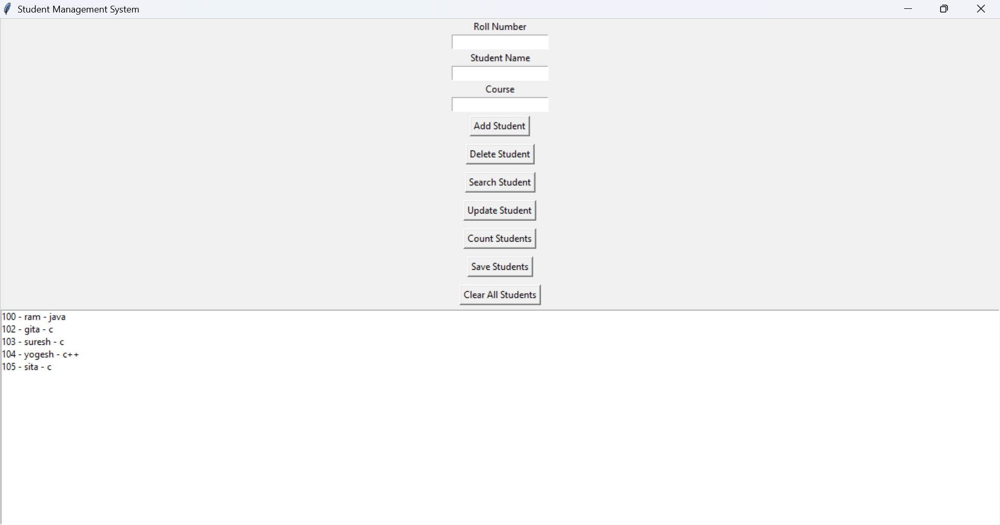

# Student Management System

A GUI-based Student Management System developed using Python and Tkinter. This application helps manage student records efficiently through a user-friendly interface.

## Features

* Add Student Records
* Update Student Information
* Delete Student Records
* Search Students by Roll Number
* Count Total Students
* Save Records to File
* Load Records from File
* Prevent Duplicate Roll Numbers
* Clear All Student Records

## Technologies Used

* Python
* Tkinter (GUI)
* File Handling

## Project Structure

* `student_management_system.py` - Main application file
* `students.txt` - Stores student records

## Screenshot



## How to Run

1. Install Python.
2. Download or clone the project.
3. Open Command Prompt in the project folder.
4. Run:

```python
python student_management_system.py
```

## Author

**Yatika Rathore**
Python Developer
